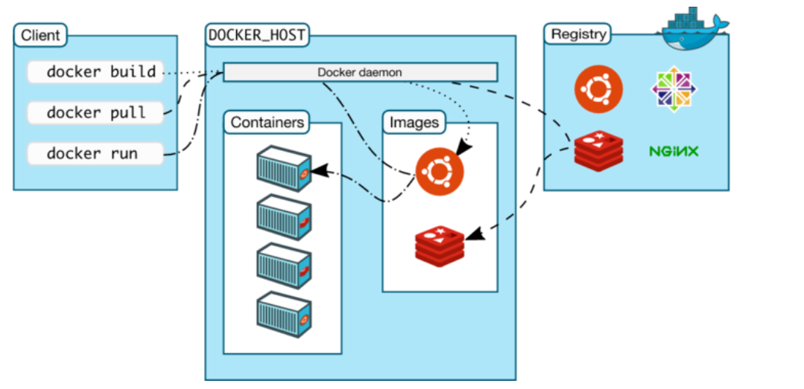

## 1. docker基础

### 1. 1 docker介绍

- docker是什么 ?

  > Docker 是一个开源的应用**容器引擎**，是直接运行在宿主操作系统之上的一个容器，使用沙箱机制完全虚拟出一个完整的操作，容器之间不会有任何接口，从而让容器与宿主机之间、容器与容器之间隔离的更加彻底。每个容器会有自己的权限管理，独立的网络与存储栈，及自己的资源管理能，使同一台宿主机上可以友好的共存多个容器。

- docker与虚拟机对比

  > <font color="red">**如果物理机是一幢住宅楼，虚拟机就是大楼中的一个个套间，而容器技术就是套间里的一个个隔断。**</font>

  - 虚拟化技术不同

    > - VMware Workstation、VirtualBoX
    >
    >   硬件辅助虚拟化：（Hardware-assisted Virtualization）是指通过硬件辅助支持模拟运行环境，使客户机操作系统可以独立运行，实现完全虚拟化的功能。
    >
    > - Docker
    >
    >   操作系统层虚拟化：（OS-level virtualization）这种技术将操作系统内核虚拟化，可以允许使用者空间软件实例被分割成几个独立的单元，在内核中运行，而不是只有一个单一实例运行。这个软件实例，也被称为是一个容器（containers）、虚拟引擎（Virtualization engine）、虚拟专用服务器（virtual private servers）。每个容器的进程是独立的，对于使用者来说，就像是在使用自己的专用服务器。
    >
    > <font color="red">以上两种虚拟化技术都属于软件虚拟化，在现有的物理平台上实现对物理平台访问的截获和模拟。在软件虚拟化技术中，有些技术不需要硬件支持；而有些软件虚拟化技术，则依赖硬件支持。</font>

  - 应用场景不同

    > - 虚拟机更擅长于彻底隔离整个运行环境。如: 云服务提供商通常采用虚拟机技术隔离不同的用户。
    > - Docker通常用于隔离不同的应用，例如前端，后端以及数据库。

  - 资源的使用率不同

    > 虚拟机启动需要数分钟，而Docker容器可以在数毫秒内启动。由于没有臃肿的从操作系统，Docker可以节省大量的磁盘空间以及其他系统资源。

- docker的版本

  - Docker-CE -> 社区版
    - Stable 版
      - 稳定版, 一个季度更新一次
    - Edge 版
      - 一个月更新一般
  - Docker-EE
    - 企业版
    - 收费的

### 1.2 docker架构与核心组件

- docker架构

  

  - 客户端
    - linux的终端
      - 通过终端, 操作一些docker命令, 完成对docker的操作
  - docker服务器
    - 是一个守护进程
      - 守护进程是不能和用户交互的, 在后台运行
    - 管理容器和镜像
  - docker镜像
    - 理解为一个可执行程序
    - 镜像可以启动, 启动之后就是容器
    - 镜像一般不需要使用者制作
    - 只占用磁盘空间
  - docker容器
    - 镜像可以启动, 启动之后就是容器
    - 占用的内存, cpu资源
  - 镜像仓库
    - docker官方提供了一个镜像仓库
      - docker hub

### 1.3 docker安装和卸载

#### 安装

```shell
# 1. 安装基本软件
$ sudo apt-get update
$ sudo apt-get install apt-transport-https ca-certificates curl software-properties-common lrzsz -y
# 2. apt仓库添加并阿里云的docker软件包
# 把下载的key添加到本地trusted数据库中。
$ sudo curl -fsSL https://mirrors.aliyun.com/docker-ce/linux/ubuntu/gpg | sudo apt-key add -
$ sudo add-apt-repository "deb [arch=amd64] https://mirrors.aliyun.com/docker-ce/linux/ubuntu $(lsb_release -cs) stable"
# 3. 升级软件源
$ sudo apt-get update
# 4. 安装docker
$ sudo apt-get install docker-ce -y
# 5. 测试docker
$ docker version
```

#### 卸载

```shell
# 卸载软件
sudo apt-get purge docker-ce 
# 删除目录
/etc/docker   # 用户的身份认证
/var/lib/docker	# 存储docker镜像, 数据卷挂载目录

$ sudo rm /etc/docker /var/lib/docker -r
```

#### docker加速器设置 -> 可选

```shell
# 访问 https://dashboard.daocloud.io 网站，登录 daocloud 账户
# 提交下载镜像的速度
# 打开加速页面, 拷贝下边的命令到linux终端, 执行
curl -sSL https://get.daocloud.io/daotools/set_mirror.sh | sh -s http://f1361db2.m.daocloud.io
# 可以去 /etc/docker/daemon.json
这个文件中添加了一句话:
{"registry-mirrors": ["http://f1361db2.m.daocloud.io"]}
# 重启docker服务
sudo systemctl restart docker
```

### 1.4 权限问题

```shell
$ docker version
Client:
 Version:           18.09.0
 API version:       1.39
 Go version:        go1.10.4
 Git commit:        4d60db4
 Built:             Wed Nov  7 00:49:01 2018
 OS/Arch:           linux/amd64
 Experimental:      false
Got permission denied while trying to connect to the Docker daemon socket at unix:///var/run/docker.sock: Get http://%2Fvar%2Frun%2Fdocker.sock/v1.39/version: dial unix /var/run/docker.sock: connect: `permission denied`

# 第一种, 执行docker命令的时候前边加 sudo
sudo docker xxxx
# 第二种, 将当前用户添加到docker组, 只需要做一次, 一劳永逸  -> 推荐
# 验证有没有docker组
vim /etc/group   # 可以不做, 安装好docker就有了
# 将当前用户添加到docker组中
sudo gpasswd -a 当前用户  组名
sudo gpasswd -a go docker   # ----= 1
# 重启docker服务器
sudo systemctl restart docker    #  ---- 2
# 切换go用户到docker组中
newgrp - docker                  # ----- 3

# 第三种, 每重启一次docker服务, 需要设置一次
# 切换目录
cd /var/run
sudo chmod 666 docker.sock
```

### 1.5 docker服务相关操作命令

```shell
# 重启
sudo systemctl restart docker
# 关闭
sudo systemctl stop docker
# 启动
sudo systemctl start docker
# 查看状态
sudo systemctl status docker
```

## 2. docker镜像管理

### 2.1 镜像的搜索/获取/查看

- #### 镜像搜索

  ```shell
  # 命令
  $ docker search 镜像的名字
  # 字段关键字
  NAME - 镜像名字
  DESCRIPTION - 镜像描述
  STARS     -   下载量
  OFFICIAL  - 是不是官方出品
  AUTOMATED - 是不是自动化编译出来的, 自动化: 通过dockerfile制作的
  ```

- 获取镜像

  ```shell
  # 下载远程仓库（如Docker Hub）中的镜像
  $ docker pull 镜像名
  # 镜像存储目录
  /var/lib/docker/image
  
  # 修改root用户的密码
  $ sudo passwd root
  输入当前用户的密码
  输入新的root用户的密码: 
  再次输入新的root用户的密码:
  # 切换到root用户
  su root
  输入的是root用户的密码
  ```

- 查看镜像

  ```shell
  # 命令
  # 查看所有的镜像
  $ docker images
  $ docker image ls
  # 查看某个镜像
  $ docker images 镜像名字
  $ docker image ls 镜像名字
  # 字段关键字
  REPOSITORY - 镜像名 ----> 很重要
  TAG        - 镜像的版本  ->  比较重要
  IMAGE ID   - 镜像的ID, 这个是唯一的  ->   很重要
  CREATED    - 镜像的创建时间
  SIZE       - 镜像的大小
  # 细节
  docker xxx ubuntu
  docker xxx ubuntu:latest
  写一个镜像名 == 镜像名:latest
  ```

### 2.2 镜像别名/删除

- 镜像别名

  ```shell
  $ docker tag SOURCE_IMAGE[:TAG] TARGET_IMAGE[:TAG]
  # 不同的名字对应的镜像ID相同
  ```

- 删除镜像

  ```shell
  $ docker rmi 镜像名/镜像ID
  # 如果镜像有别名, 必须根据名字:tag(如果tag不是latest就需要加, 如果是可以省略)
  #	设置两个别名, 还有一个默认的名字, 需要删除 3 次, 镜像才能被删掉
  # 没有别名, 可以根据镜像名或者镜像ID删除
  ```

### 2.3 镜像的导入导出

- 镜像导出

  ```shell
  $ docker save [OPTIONS] IMAGE [IMAGE...]
     - OPTIONS:
     	-o, --output 
     		参数后跟导出的镜像的名字(随便起名)
     - IMAGE
     		本地镜像仓库中的镜像名
     		通过 docker images
  ```

- 镜像导入

  ```shell
  $ docker load [OPTIONS]
  	-i, --input string
  		string: 通过save导出之后的文件名
  		
  $ docker load < 通过save导出之后的文件名
  ```

### 2.4 镜像的历史和详细信息

- 查看镜像的历史信息

  ```shell
  # 制作镜像的时候的操作步骤
  $ docker history 镜像名/镜像ID
  ```

- 查看镜像的详细信息

  ```shell
  # 镜像的属性信息, 以json格式输出的
  # https://yq.aliyun.com/articles/230067
  $ docker inspect 镜像名/镜像ID
  $ docker inspect -f {{.}} 
  ```

### 2.6 总结


```shell
docker --help
docker subcmd --help
	subcmd :
		tag
		rmi
		images
```


## 3. docker容器管理

docker将镜像文件启动, 得到一个容器, 一个容器可以被看做一个操作系统

### 3.1 容器的查看/创建/启动

- 容器查看

  ```shell
  # 命令, 只能看到正在运行的容器的状态
  $ docker ps
  # 关键字
  CONTAINER ID: 容器启动之后的ID, 这个ID是唯一的
  IMAGE: 这个容器是通过哪个镜像启动起来的, 对应的是镜像的名字
  COMMAND: 镜像启动之后, 默认执行的第一个命令
  CREATED: 容器创建的时间
  STATUS: 容器当前的状态
  		- 运行
  		- 停止
  		- 暂停
  PORTS: 容器和宿主机对应的映射端口
  NAMES: 容器启动之后的名字, 启动镜像的时候没有指定名字, 会自定指定, 是随机的
  # 参数
  -a, --all:  查看所有的容器的状态
  		- 运行
  		- 停止
  		- 暂停
  -q, --quiet: 只显示容器的ID
  ```

- 容器创建

  ```shell
  # 容器被创建, 但是还不能使用, 需要启动
  $ docker create [OPTIONS] IMAGE [COMMAND] [ARG...]
   - OPTIONS: 
   	-i, --interactive: 创建的容器是否关联标准输入
   	-t, --tty: 是不是给这个容器分配终端
   	--rm: 容器被停止(关闭)之后, 是否自动删除容器
      --name: 创建容器的时候给容器起名, 没指定, 随机生成
    - IMAGE: 容器是基于那个镜像启动, 指定的是镜像的名字
    - [COMMAND] [ARG...]
    	容器启动之后, 指定一个默认执行的shell命令, 根据实际情况指定, 如果不指定写什么, 写 bash
    	ls -a
    	pwd
  ```

- 容器启动

  - 启动创建的容器

    ```shell
    $ docker start 参数 容器的名字
    	- 参数: 
    		a: 关联标准输出和标准错误
    		i: 关联表示输入
    # 应用场景:
    1. 容器创建之后, 启动
    2. 容器被关闭(停止), 重新启动
    ```

  - 创建新容器并启动

    ```shell
    # 创建并运行容器 run == create + start
    $ docker run    [OPTIONS] IMAGE [COMMAND] [ARG...]
    $ docker create [OPTIONS] IMAGE [COMMAND] [ARG...]
    - OPTIONS:
    	-i, --interactive: 关联标准输入
     	-t, --tty: 给容器分配一个终端
     	--rm: 容器关闭, 自动删除容器
        --name: 给容器命名
        -d, --detach: 容器启动之后是不是守护进程, 如果是守护进程容器在后台运行
    - IMAGE: 容器名字/容器ID
    - [COMMAND] [ARG...]
    	容器启动之后运行的第一个shell命令
    ```

### 3.2 容器的暂停/重启

- 暂停

  ```shell
  docker pause 容器名/容器ID
  ```

- 取消暂停

  ```shell
  docker unpause 容器名/容器ID
  ```

- 重启

  ```shell
  docker restart 容器名/容器ID
  ```


### 3.3 容器的关闭/终止/删除

- 关闭

  ```shell
  # 延时关闭, 默认10s
  docker stop 容器名/容器ID
  参数:
    -t, --time: 在指定是时长之后关闭容器
  ```

- 终止

  ```shell
  # 马上关闭, 不会延时
  docker kill 容器名/容器ID
  ```

- 删除
  - 删除未运行的容器 -> 状态fei up

    ```shell
    docker rm 容器名/容器ID
    ```

  - 删除运行的容器

    ```shell
    docker rm -f 容器名/容器ID 容器名/容器ID 容器名/容器ID
    ```

  - 批量删除容器

    ```shell
    docker rm -f $(docker ps -aq)
    docker rm -f `docker ps -aq`
    ```

### 3.4 容器的进入/退出

- 进入容器

  - 创建并进入

    ```shell
    $ docker run -it --name 容器名 镜像名 shell命令(bash)
    ```

  - 手动进入

    ```shell
    $ docker run -itd --name 容器名 镜像名 shell命令(bash)
    $ docker exec 参数 容器名 bash
    	参数:
    		- i: 关联标准输入
    		- t: 分配一个操作终端
    ```

- 退出容器

  ```shell
  如果通过exec 进入到容器内部
  输入: exit命令
  快捷键: ctrl+d
  ```

### 3.5 容器的日志/信息/端口/重命名

- 查看容器的日志信息

  ```shell
  docker logs 容器名/容器ID
  ```

- 查看容器的详细信息

  ```shell
  # https://yq.aliyun.com/articles/230067
  # 查看镜像的详细信息
  docker inspect 容器名/容器ID
  ```

- 查看容器的端口信息

  ```shell
  # 查看本机和容器的端口映射
  docker port 容器名/容器ID
  ```

- 容器重命名

  ```shell
  docker rename 旧名字 新名字
  ```


### 3.6 总结


