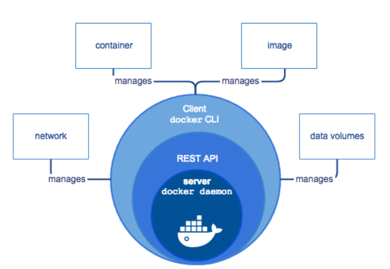
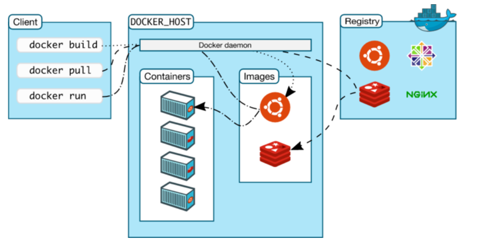

# 第 1 章 Docker基础

## 1.1 docker简介

在这一部分我们主要讲两个方面：
docker是什么、docker特点

### 1.1.1 docker是什么

#### docker是什么？

​	docker的中文解释是**码头工人**。

**官方解释：**

​	Docker是一个开源的容器引擎，它基于LCX容器技术，使用Go语言开发。

​	源代码托管在Github上，并遵从Apache2.0协议。

​	Docker采用C/S架构，其可以轻松的为任何应用创建一个轻量级的、可移植的、自给自足的容器。

​	Docker就是一种快速解决生产问题的一种技术手段,开发，运行和部署应用程序的开放管理平台。

​	**开发人员**能利用docker 开发和运行应用程序

​	**运维人员**能利用docker 部署和管理应用程序


#### Docker的生活场景对比：

|        |                                  |
| ------ | -------------------------------- |
| 物理机 |  |
| 虚拟机 |  |
| 容器是 |  |

#### 单独的理解一下容器:

| 动画片《七龙珠》里面的胶囊       | 1号胶囊启动后的效果          |
| -------------------------------- | ---------------------------- |
|  |  |

​	Docker提供了在一个完全隔离的环境中打包和运行应用程序的能力，这个隔离的环境被称为容器。

​	由于容器的隔离性和安全性，因此可以在一个主机(宿主机)上同时运行多个相互隔离的容器，互不干预。

### 1.1.2为什么使用Docker

​	Docker使您能够将应用程序与基础架构分开，以便您可以快速交付软件。

​	借助Docker，您可以像管理应用程序一样管理基础架构。

​	通过利用Docker的方法快速进行运输，测试和部署代码，您可以显着缩短编写代码和在生产环境中运行代码之间的延迟。

**例如:**
​	开发人员在本地编写代码，可以使用Docker同事进行共享，实现协同工作。

​	使用Docker开发完成程序，可以直接对应用程序执行自动和手动测试。

​	当开发人员发现错误或BUG时，可以直接在开发环境中修复后，并迅速将它们重新部署到测试环境进行测试和验证。

​	利用Docker开发完成后，交付时，直接交付Docker，也就意味着交付完成。后续如果有提供修补程序或更新，需要推送到生成环境运行起来，也是一样的简单。

**Docker主要解决的问题：**

​	保证程序运行环境的一致性；

​	降低配置开发环境、生产环境的复杂度和成本；

​	实现程序的快速部署和分发。

### 1.1.3Docker的架构与结构

**架构图**



**Docker**是采用了(c/s)架构模式的应用程序

Client dockerCLI :客户端docker命令行

REST API : 一套介于客户端与服务端的之间进行通信并指示其执行的接口

Server docker daemon:服务端dacker守护进程等待客户端发送命令来执行


**Docker**的四大核心技术

IMAGE-镜像

CONTAINER-容器

DATA VOLUMES-数据卷

NETWORK-网络


**结构图**




**Docker客户端(Docker Client)** 

Docker客户端(Docker Client)是用户与Docker进行交互的最主要方式。当在终端输入docker命令时，对应的就会在服务端产生对应的作用，并把结果返回给客户端。Docker Client除了连接本地服务端，通过更改或指定DOCKER_HOST连接远程服务端。

**Docker服务端(Docker Server)**

Docker Daemon其实就是Docker 的服务端。它负责监听Docker API请求(如Docker Client)并管理Docker对象(Docker Objects)，如镜像、容器、网络、数据卷等

**Docker Registries**

俗称Docker仓库，专门用于存储镜像的云服务环境.

Docker Hub就是一个公有的存放镜像的地方，类似Github存储代码文件。同样的也可以类似Github那样搭建私有的仓库。

**Docker 对象(Docker Objects)** 

镜像：一个Docker的可执行文件，其中包括运行应用程序所需的所有代码内容、依赖库、环境变量和配置文件等。

容器：镜像被运行起来后的实例。

网络：外部或者容器间如何互相访问的网络方式，如host模式、bridge模式。

数据卷：容器与宿主机之间、容器与容器之间共享存储方式，类似虚拟机与主机之间的共享文件目录。


### 1.1.4官方资料：

Docker 官网：http://www.docker.com

Github Docker 源码：https://github.com/docker/docker

Docker 英文文档网址：https://docs.docker.com/

Docker 中文文档网址：http://docker-doc.readthedocs.io/zh_CN/latest/


### 1.1.4docker特点

三大理念：
构建：龙珠里的胶囊，将你需要的场景构建好，装在一个小胶囊里

运输：随身携带着房子、车子等，非常方便

运行：只需要你轻轻按一下胶囊，找个合适的地方一放，就ok了

优点：
多：    适用场景多

快：    环境部署快、更新快

好：    好多人在用

省：    省钱省力省人工


缺点：
太腻歪人：  依赖操作系统

不善沟通：  依赖网络

不善理财：  银行U盾等场景不能用

## 1.2 docker快速入门


### 1.2.1docker历程：

​	自2013年出现以来，发展势头很猛，现在可说是风靡全球。

​	docker的第一版为0.1.0 发布于2013年03月23日

​	Docker2017年改版前的版本号是1.13.1发布于2017年02月08日

​	Docker从1.13.x版本开始，版本分为企业版EE和社区版CE，版本号也改为按照时间线来发布，比如17.03就是2017年3月，有点类似于ubuntu的版本发布方式。
​	企业版自然会提供一些额外的服务，当然肯定也是收费的。
​	企业版说明https://blog.docker.com/2017/03/docker-enterprise-edition/
社区版分为stable和edge两种发布方式。

stable版本是季度发布方式，比如17.03, 17.06, 17.09

edge版本是月份发布方式， 比如17.03, 17.04......


注：

Stable：gives you reliable updates every quarter

(稳定:给你可靠的每季度更新一次)

Edge：gives you new features every month

(优势:每个月给你新特性)


### 1.2.2 官方要求

为什么用ubuntu学docker

 

图片来源：https://docs.docker.com/engine/installation/#server

docker要求的ubuntu环境


ubuntu下载地址：https://www.ubuntu.com/download/desktop

#### ubuntu主机环境需求

```shell
#执行命令
$ uname -a
$ ls -l /sys/class/misc/device-mapper
```


##### 执行效果


### 1.2.3 部署docker

#### 官网参考：

https://docs.docker.com/engine/installation/linux/docker-ce/ubuntu/#upgrade-docker-after-using-the-convenience-script

#### 安装步骤

```shell
#安装基本软件
$ sudo apt-get update
$ sudo apt-get install apt-transport-https ca-certificates curl software-properties-common lrzsz -y
#使用官方推荐源{不推荐}#
$ sudo curl -fsSL https://download.docker.com/linux/ubuntu/gpg | sudo apt-key add -
add-apt-repository "deb [arch=amd64] https://download.docker.com/linux/ubuntu $(lsb_release -cs) stable"
#使用阿里云的源{推荐}
$ sudo curl -fsSL https://mirrors.aliyun.com/docker-ce/linux/ubuntu/gpg | sudo apt-key add -
$ sudo add-apt-repository "deb [arch=amd64] https://mirrors.aliyun.com/docker-ce/linux/ubuntu $(lsb_release -cs) stable"

#软件源升级
$ sudo apt-get update

#安装docker
$ sudo apt-get install docker-ce -y

#注：
#可以指定版本安装docker：
$ sudo apt-get install docker-ce=<VERSION> -y
  
#查看支持的docker版本
$ sudo apt-cache madison docker-ce
#测试docker
docker version
```


#### 网卡区别：

安装前：只有ens33和lo网卡

 

安装后：docker启动后，多出来了docker0网卡，网卡地址172.17.0.1

 


### 1.2.4 docker加速器

在国内使用docker的官方镜像源，会因为网络的原因，造成无法下载，或者一直处于超时。所以我们使用 daocloud的方法进行加速配置。
加速器文档链接：http://guide.daocloud.io/dcs/daocloud-9153151.html

#### 方法:

访问 https://dashboard.daocloud.io 网站，登录 daocloud 账户

 


点击右上角的 加速器


在新窗口处会显示一条命令，


```shell
#我们执行这条命令
curl -sSL https://get.daocloud.io/daotools/set_mirror.sh | sh -s http://f1361db2.m.daocloud.io

# cat /etc/docker/daemon.json
{"registry-mirrors": ["http://f1361db2.m.daocloud.io"]}
#重启docker
systemctl restart docker
```

### 1.2.5 docker 其他简介

#### docker的基本命令格式：

```shell
#基本格式
systemctl [参数] docker
#参数详解：
	start         开启服务
    stop          关闭
    restart       重启
    status        状态
```


#### 删除docker命令：

```shell
$  sudo apt-get purge docker-ce -y
$  sudo rm -rf /etc/docker
$  sudo rm -rf /var/lib/docker/
```

#### docker基本目录简介:

```SHELL
/etc/docker/                #docker的认证目录
/var/lib/docker/            #docker的应用目录
```


#### docker常见问题:

##### 背景

​	因为使用的是sudo安装docker，所以会导致一个问题。以普通用户登录的状况下，在使用docker images时必须添加sudo，那么如何让docker免sudo依然可用呢？

##### 理清问题

​	当以普通用户身份去使用docker命令时，出现以下错误：

```shell
Got permission denied while trying to connect to the Docker daemon socket at unix:///var/run/docker.sock: Post http://%2Fvar%2Frun%2Fdocker.sock/v1.35/images/create?fromSrc=-&message=&repo=ubuntu-16.04&tag=: dial unix /var/run/docker.sock: connect: permission denied
```

​	可以看都，最后告知我们时权限的问题。那么在linux文件权限有三个数据左右drwxrwxrwx，其中第一为d代表该文件是一个文件夹前三位、中三位、后三位分别代表这属主权限、属组权限、其他人权限。


​	上图是报错文件的权限展示，可以看到其属主为root，权限为rw，可读可写；其属组为docker，权限为rw，可读可写。如果要当前用户可直接读取该文件，那么我们就为docker.sock 添加一个其他用户可读写权限 或者添加1个用户组就可以了

##### 方法1：一劳永逸

```shell
#如果还没有 docker group 就添加一个：
$sudo groupadd docker
#将用户加入该 group 内。然后退出并重新登录就生效啦。
$sudo gpasswd -a ${USER} docker
#重启 docker 服务
$systemctl restart docker
#切换当前会话到新 group 或者重启 X 会话
$newgrp - docker
#注意:最后一步是必须的，否则因为 groups 命令获取到的是缓存的组信息，刚添加的组信息未能生效，
#所以 docker images 执行时同样有错。
```

##### 方法2：

```shell
#每次启动docker或者重启docker的之后
$cd /var/run
$sudo chmod 666 docker.sock
```

##### 方法3：每条命令前面加上sudo


