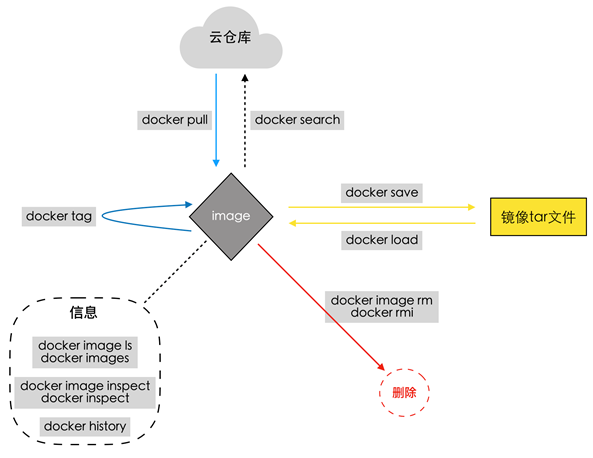
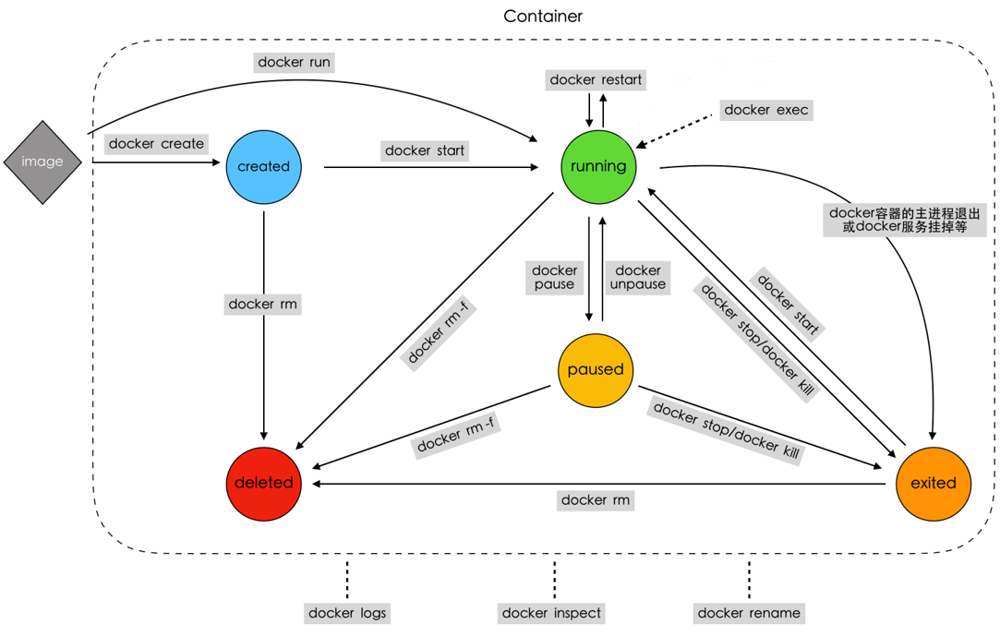
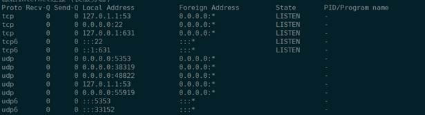
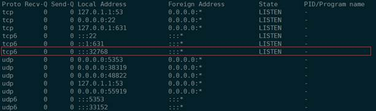
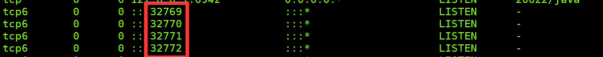
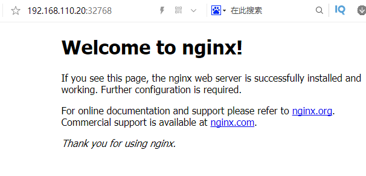
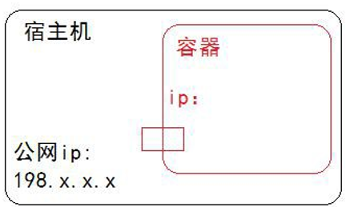
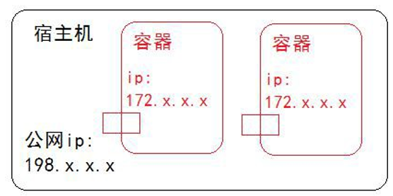
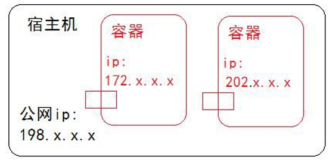
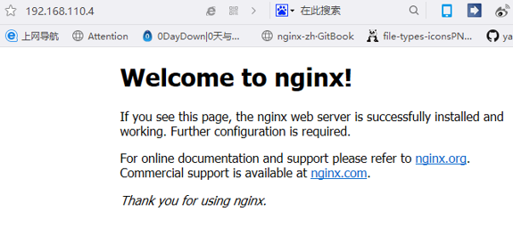

# 第 2 章 Docker 核心技术

Docker的核心技术内容很多，我们学习则从以下四个方面来介绍Docker的核心技术
**镜像**、**容器**、**数据**、**网络**

## 2.1 docker镜像管理

### 2.1.1 镜像简介

Docker镜像是什么？
​	镜像是一个Docker的可执行文件，其中包括运行应用程序所需的所有代码内容、依赖库、环境变量和配置文件等。
​	通过镜像可以创建一个或多个容器。

### 2.1.2 搜索、查看、获取


#### 搜索镜像

```shell
#作用
	搜索Docker Hub(镜像仓库)上的镜像
#命令格式：
    docker search [镜像名称]
#命令演示：
$ docker search ubuntu
#NAME：名称
#DESCRIPTION：基本功能描述
#STARS：下载次数
#OFFICIAL：官方
#AUTOMATED：自动的运行
```


#### 获取镜像

```shell
#作用：
	下载远程仓库（如Docker Hub）中的镜像
#命令格式：
docker pull [镜像名称]
#命令演示：
$ docker pull ubuntu
$ docker pull nginx

#注释：
#获取的镜像在哪里？
#/var/lib/docker 目录下

#由于权限的原因我们需要切换root用户
#那我们首先要重设置root用户的密码：
:~$ sudo passwd root
#这样就可以设置root用户的密码了。
#之后就可以自由的切换到root用户了
:~$ su
#输入root用户的密码即可。

#当然，如果想从root用户切换回一般用户，则可使用 su -val(一般用户名)
#而当你再次切回到root用户，则只需要键入exit,再次输入exit则回到最初的用户下
#操作下面的文件可以查看相关的镜像信息       
:~$ vim /var/lib/docker/image/overlay2/repositories.json 
```


#### 查看镜像

```shell
#作用：
	列出本地镜像
#命令格式：
docker images [镜像名称]
docker image ls [镜像名称]
#命令演示：
$ docker images
#镜像的ID唯一标识了镜像，如果ID相同,说明是同一镜像。TAG信息来区分不同发行版本，如果不指定具体标记,默认使用latest标记信息
#docker images -a 列出所有的本地的images(中间映像层默认不显示)
#REPOSITORY：镜像的名称 
#TAG ：镜像的版本标签
#IMAGE ID：镜像id
#CREATED：镜像是什么时候创建的
#SIZE：大小
```

### 2.1.3 重命名、删除

#### 镜像重命名

```shell
#作用：
	对本地镜像的NAME、TAG进行重命名，并新产生一个命名后镜像
#命令格式：
docker tag [老镜像名称]:[老镜像版本][新镜像名称]:[新镜像版本]
#命令演示：
$ docker tag nginx:latest panda-nginx:v1.0
```


#### 删除镜像

```shell
#作用：
	将本地的一个或多个镜像删除
#命令格式：
docker rmi [命令参数][镜像ID]
docker rmi [命令参数][镜像名称]:[镜像版本]
docker image rm [命令参数][镜像]
#命令演示：
$docker rmi 3fa822599e10
$docker rmi mysql:latest
#注意：
如果一个image_id存在多个名称，那么应该使用 名称:版本 的格式删除镜像
#命令参数(OPTIONS)：	
	-f, --force      		强制删除
```


### 2.1.4 导出、导入

#### 导出镜像

将已经下载好的镜像，导出到本地，以备后用。

```shell
#作用：
	将本地的一个或多个镜像打包保存成本地tar文件
#命令格式：
docker save [命令参数][导出镜像名称][本地镜像镜像]
#命令参数(OPTIONS)：	
	-o, --output string   		指定写入的文件名和路径
#导出镜像
:~$ docker save -o nginx.tar nginx
```


#### 导入镜像

```shell
#作用：
	将save命令打包的镜像导入本地镜像库中
#导入镜像命令格式：
$ docker load [命令参数][被导入镜像压缩文件的名称]
$ docker load < [被导入镜像压缩文件的名称]
$ docker load --input [被导入镜像压缩文件的名称]
#命令参数(OPTIONS)：	
	-i,  --input string   	指定要打入的文件，如没有指定，默认是STDIN
	
#为了更好的演示效果，我们先将nginx的镜像删除掉
docker rmi nginx:v1.0
docker rmi nginx    

#导入镜像文件：
$ docker load < nginx.tar
#注意：
	如果发现导入的时候没有权限需要使用chmod命令修改镜像文件的权限
```


### 2.1.5 历史、创建

#### 查看镜像历史


```shell
#作用：
	查看本地一个镜像的历史(历史分层)信息
#查看镜像命令格式：
docker history [镜像名称]:[镜像版本]
docker history [镜像ID]
#我们获取到一个镜像，想知道他默认启动了哪些命令或者都封装了哪些系统层，那么我们可以使用docker history这条命令来获取我们想要的信息
$ docker history sswang-nginx:v1.0
 
#IMAGE：编号           
#CREATED：创建的  
#CREATED BY ：基于那些命令创建的                                 
#SIZE：大小
#COMMENT：评论
```

#### 镜像详细信息 

```shell
#作用：
	查看本地一个或多个镜像的详细信息
#命令格式：
$ docker image inspect [命令参数] [镜像名称]:[镜像版本]
$ docker inspect [命令参数] [镜像ID]
#查看镜像详细信息：
$ docker inspect nginx
```

### 2.1.6总结



## 2.2 容器管理

​	docker容器技术指Docker是一个由GO语言写的程序运行的“容器”（Linux containers， LXCs）

​       containers的中文解释是集装箱。

​    Docker则实现了一种应用程序级别的隔离，它改变我们基本的开发、操作单元，由直接操作虚拟主机（VM）,转换到操作程序运行的“容器”上来。


### 2.2.1 容器简介

#### 容器是什么？

​	容器（Container）：容器是一种轻量级、可移植、并将应用程序进行的打包的技术，使应用程序可以在几乎任何地方以相同的方式运行

​	•Docker将镜像文件运行起来后，产生的对象就是容器。容器相当于是镜像运行起来的一个实例。

​	•容器具备一定的生命周期。

​	•另外，可以借助docker ps命令查看运行的容器，如同在linux上利用ps命令查看运行着的进程那样。

​	我们就可以理解容器就是被封装起来的进程操作,只不过现在的进程可以简单也可以复杂,复杂的话可以运行1个操作系统.简单的话可以运行1个回显字符串.

#### 容器与虚拟机的相同点

•容器和虚拟机一样，都会对物理硬件资源进行共享使用。

•容器和虚拟机的生命周期比较相似（创建、运行、暂停、关闭等等）。

•容器中或虚拟机中都可以安装各种应用，如redis、mysql、nginx等。也就是说，在容器中的操作，如同在一个虚拟机(操作系统)中操作一样。

•同虚拟机一样，容器创建后，会存储在宿主机上：linux上位于/var/lib/docker/containers下

#### 容器与虚拟机的不同点

**注意**：容器并不是虚拟机，但它们有很多相似的地方

•虚拟机的创建、启动和关闭都是基于一个完整的操作系统。一个虚拟机就是一个完整的操作系统。而容器直接运行在宿主机的内核上，其本质上以一系列进程的结合。

•容器是轻量级的，虚拟机是重量级的。

​	首先容器不需要额外的资源来管理，虚拟机额外更多的性能消耗；

​	其次创建、启动或关闭容器，如同创建、启动或者关闭进程那么轻松，而创建、启动、关闭一个操作系统就没那么方便了。

•也因此，意味着在给定的硬件上能运行更多数量的容器，甚至可以直接把Docker运行在虚拟机上。


### 2.2.2 查看、创建、启动

#### 查看容器

```shell
#作用
	显示docker容器列表
#命令格式：
docker ps
#命令演示：
$ docker ps
#CONTAINER ID 容器ID        
#IMAGE 基于那个镜像              
#COMMAND  运行镜像使用了哪些命令？           
#CREATED多久前创建时间             
#STATUS   开启还是关闭           
#PORTS端口号               
#NAMES容器名称默认是随机的
#注意：
管理docker容器可以通过名称，也可以通过ID
ps是显示正在运行的容器， -a是显示所有运行过的容器，包括已经不运行的容器
```


#### 创建待启动容器

```shell
#作用：
	利用镜像创建出一个Created 状态的待启动容器
#命令格式：
	docker create [OPTIONS] IMAGE [COMMAND] [ARG...]
	docker create [参数命令] 依赖镜像 [容器内命令] [命令参数]
#命令参数(OPTIONS)：查看更多
	-t, --tty           		分配一个伪TTY，也就是分配虚拟终端
    -i, --interactive    	    即使没有连接，也要保持STDIN打开
        --name          		为容器起名，如果没有指定将会随机产生一个名称
#命令参数（COMMAND\ARG）:
	COMMAND 表示容器启动后，需要在容器中执行的命令，如ps、ls 等命令
	ARG 表示执行 COMMAND 时需要提供的一些参数，如ps 命令的 aux、ls命令的-a等等
#创建容器（附上ls命令和a参数）
	docker create -it --name ubuntu-1  ubuntu ls -a
```


**启动容器**

启动容器有三种方式

1、启动待启动或已关闭容器

2、基于镜像新建一个容器并启动

3、守护进程方式启动docker

#### 启动容器

```shell
#作用：
	将一个或多个处于创建状态或关闭状态的容器启动起来

#命令格式：
docker start [容器名称]或[容器ID]
#命令参数(OPTIONS)：
	-a, --attach		将当前shell的 STDOUT/STDERR 连接到容器上
	-i, --interactive		将当前shell的 STDIN连接到容器上	
#启动上面创建的容器 
	docker start -a ubuntu-1		
```

#### 创建新容器并启动

```shell
#作用：
	利用镜像创建并启动一个容器
#命令格式：
docker run [命令参数]  [镜像名称][执行的命令]
命令参数(OPTIONS)：
	-t, --tty           	分配一个伪TTY，也就是分配虚拟终端
    -i, --interactive    	即使没有连接，也要保持STDIN打开
        --name          	为容器起名，如果没有指定将会随机产生一个名称
	-d, --detach			在后台运行容器并打印出容器ID
	--rm					当容器退出运行后，自动删除容器

#启动一个镜像输出内容并删除容器
$ docker run --rm  --name nginx1   nginx  /bin/echo "hello docker" 


#注意：
docker run 其实 是两个命令的集合体 docker create + docker start
```


#### 守护进程方式启动容器<常用的方式>

更多的时候，需要让Docker容器在后台以守护形式运行。此时可以通过添加-d参数来实现

```shell
#命令格式：
docker run -d [image_name] command ...
#守护进程方式启动容器:
:~$ docker run -d nginx
```

### 2.2.3暂停与取消暂停与重启

#### 容器暂停 

```shell
#作用：
	暂停一个或多个处于运行状态的容器
#命令格式：
	docker pause [容器名称]或[容器ID]
#暂停容器
	docker pause a229eabf1f32 

```

#### 容器取消暂停

```shell
#作用：
	取消一个或多个处于暂停状态的容器，恢复运行
#命令格式：
	docker unpause [容器名称]或[容器ID]
#恢复容器
	docker unpause a229eabf1f32
```

#### 重启

```shell
#作用：
	重启一个或多个处于运行状态、暂停状态、关闭状态或者新建状态的容器
	该命令相当于stop和start命令的结合
#命令格式：
	docker restart [容器名称]或[容器ID]
#命令参数(OPTIONS)：
	 -t, --time int   		重启前，等待的时间，单位秒(默认 10s) 

#恢复容器
	docker restart -t 20 a229eabf1f32
```


### 2.2.4 关闭、终止、删除

#### 关闭容器

在生产中，我们会以为临时情况，要关闭某些容器，我们使用 stop 命令来关闭某个容器

```shell
#作用：
	延迟关闭一个或多个处于暂停状态或者运行状态的容器
#命令格式：
  docker stop [容器名称]或[容器ID]

#关闭容器:
$ docker stop  8005c40a1d16
```


#### 终止容器

```shell
#作用：
	强制并立即关闭一个或多个处于暂停状态或者运行状态的容器
#命令格式：
	docker kill [容器名称]或[容器ID]
#终止容器
$ docker kill  8005c40a1d16
```


####  

#### 删除容器

删除容器有三种方法：
正常删除    --        删除已关闭的

强制删除    --        删除正在运行的

强制批量删除 --        删除全部的容器


##### 正常删除容器

```shell
#作用：
	删除一个或者多个容器

#命令格式：
$ docker rm [容器名称]或[容器ID]   
#删除已关闭的容器:
$ docker rm 1a5f6a0c9443
```


```
Error response from daemon: You cannot remove a running container c7f5e7fe5aca00e0cb987d486dab3502ac93d7180016cfae9ddcc64e56149fc9. Stop the container before attempting removal or force remove
错误响应守护进程:你不能删除一个容器c7f5e7fe5aca00e0cb987d486dab3502ac93d7180016cfae9ddcc64e56149fc9运行。在尝试拆卸或强制拆卸之前，先停止容器。

```


##### 强制删除运行容器

```shell
#作用：
	强制删除一个或者多个容器
#命令格式：
  docker rm -f [容器名称]或[容器ID]
#删除正在运行的容器
$ docker rm -f 8005c40a1d16
```

##### 拓展批量关闭容器

```shell
#作用：
	批量强制删除一个或者多个容器
#命令格式：
$ docker rm -f $(docker ps -a -q)
#按照执行顺序$（）， 获取到现在容器的id然后进行删除
```


### 2.2.5 进入、退出

**进入容器我们学习三种方法：**

1、创建容器的同时进入容器
2、手工方式进入容器

#### 创建并进入容器


```shell
#命令格式：
docker run --name [container_name] -it [docker_image] /bin/bash

#命令演示：
$  docker run -it --name panda-nginx nginx /bin/bash
#进入容器后
root@7c5a24a68f96:/# echo "hello world"
hello world

root@7c5a24a68f96:/# exit
exit        
 
#docker 容器启动命令参数详解：
#--name:给容器定义一个名称
#-i:则让容器的标准输入保持打开。
#-t:让docker分配一个伪终端,并绑定到容器的标准输入上
#/bin/bash:执行一个命令
```


#### 退出容器：

```shell
#方法一：
exit
#方法二：
Ctrl + D
```

#### 手工方式进入容器

```shell
#命令格式：
docker exec -it  容器id  /bin/bash
#效果演示：
$ docker exec -it d74fff341687 /bin/bash
```

### 2.2.6 基于容器创建镜像

#### 导出镜像的第二种方式:

```shell
#命令格式：
docker export [容器id] > 模板文件名.tar
#命令演示：
#创建镜像:
$ docker export ae63ab299a84 > nginx.tar
#导入镜像:
$ cat nginx.tar | docker import - panda-test
```


| 导出（export）导入（import）与保存（save）加载（load）的恩怨情仇 |
| ------------------------------------------------------------ |
| import与load的区别：<br/>import可以重新指定镜像的名字，docker load不可以 |
| export 与 保存 save 的区别：<br/>1、export导出的镜像文件大小，小于 save保存的镜像。<br/>2、export 导出（import导入）是根据容器拿到的镜像，再导入时会丢失镜像所有的历史。 |


### 2.2.7 日志、信息、端口、重命名

#### 查看容器运行日志

```shell
#命令格式：
docker logs [容器id]
#命令效果：
$ docker logs 7c5a24a68f96
```


#### 查看容器详细信息

```shell
#命令格式：
docker inspect [容器id]
#命令效果：
查看容器全部信息:
$ docker inspect 930f29ccdf8a
查看容器网络信息:
$ docker inspect --format='{{range .NetworkSettings.Networks}}{{.IPAddress}}{{end}}' 930f29ccdf8a
```


#### 查看容器端口信息

```shell
#命令格式：
docker port [容器id]
#命令效果：
$ docker port 930f29ccdf8a
#没有效果没有和宿主机关联
```

#### 容器重命名

```shell
#作用：
	修改容器的名称
#命令格式：
	docker rename [容器id]或[容器名称] [容器新名称]
#命令效果：
$ docker rename 930f29ccdf8a u1

```


#### 总结




## 2.3 数据管理

​	生产环境使用Docker的过程中，往往需要对数据进行持久化保存，或者需要更多容器之间进行数据共享，那我们需要怎么要的操作呢？

​	答案就是：数据卷（Data Volumes）和数据卷容器（Data Volume Containers）

### 2.3.1 数据卷简介

#### 什么是数据卷？

​	就是将宿主机的某个目录，映射到容器中，作为数据存储的目录，我们就可以在宿主机对数据进行存储  

​	数据卷（Data Volumes）：容器内数据直接映射到本地主机环境

##### 数据卷特性

1、数据卷可以在容器之间共享和重用，本地与容器间传递数据更高效；

2、对数据卷的修改会立马有效，容器内部与本地目录均可；

3、对数据卷的更新，不会影响镜像，对数据与应用进行了解耦操作；

4、卷会一直存在，直到没有容器使用。

#### docker 数据卷命令详解

```shell
:~$ docker run --help

-v, --volume list               Bind mount a volume (default [])
                                    挂载一个数据卷，默认为空
```


​	我们可以使用命令 docker run 用来创建容器，可以在使用docker run 命令时添加 -v 参数，就可以创建并挂载一个到多个数据卷到当前运行的容器中。
​	-v 参数的作用是将宿主机的一个目录作为容器的数据卷挂载到docker容器中，使宿主机和容器之间可以共享一个 目录，如果本地路径不存在，Docker也会自动创建。


### 2.3.2 数据卷实践

​	关于数据卷的管理我们从两个方面来说：

1、目录

2、普通文件

#### 数据卷实践 之 目录


```shell
#命令格式：
docker run -itd --name [容器名字] -v [宿主机目录]:[容器目录][镜像名称] [命令(可选)]

#命令演示：
#创建测试文件:
$ echo "file1" > tmp/file1.txt
#启动一个容器，挂载数据卷:
$ docker run -itd --name test1 -v /home/itcast/tmp/:/test1/  nginx
#注意宿主机目录需要绝对路径
#测试效果
$ docker exec -it a53c61c77 /bin/bash
root@a53c61c77bde:/# cat /test1/file1.txt 
file1
```


#### 数据卷实践 之 文件{不推荐}


```shell
#命令格式：
docker run -itd --name [容器名字] -v [宿主机文件]:[容器文件][镜像名称] [命令(可选)]

#命令演示：
#创建测试文件
$ echo "file1" > /tmp/file1.txt
#启动一个容器，挂载数据卷
$ docker run -itd --name test2 -v /home/itcast/tmp/file1.txt:/nihao/nihao.sh nginx
 
#测试效果
:~$ docker exec -it 84c37743 /bin/bash
root@84c37743d339:/# cat /nihao/nihao.sh 
file1
```

#### 注意：

```shell
1、Docker挂载数据卷的默认读写权限（rw），用户可以通过ro设置为只读
格式：[宿主机文件]:[容器文件]:ro
2、如果直接挂载一个文件到容器，使用文件工具进行编辑，可能会造成文件的改变，从Docker1.1.0起，这会导致报错误信息。所以推荐的方式是直接挂在文件所在的目录。
```


### 2.3.3 数据卷容器简介

什么是数据卷容器？
需要在多个容器之间共享一些持续更新的数据，最简单的方式是使用数据卷容器。数据卷容器也是一个容器，但是它的目的是专门用来提供数据卷供其他容器挂载。

数据卷容器（Data Volume Containers）：使用特定容器维护数据卷

简单点：数据卷容器就是为其他容器提供数据交互存储的容器

#### docker 数据卷命令详解

```shell
:~$  docker run --help
。。。
-v, --volume            Bind mount a volume 
--volumes-from list     Mount volumes from the specified container(s) (default[])
                                  #从指定的容器挂载卷，默认为空
```


#### 数据卷容器操作流程

如果使用数据卷容器，在多个容器间共享数据，并永久保存这些数据，需要有一个规范的流程才能做得到：

1、创建数据卷容器

2、其他容器挂载数据卷容器

注意：
数据卷容器自身并不需要启动，但是启动的时候依然可以进行数据卷容器的工作。

### 2.3.4 数据卷容器实践

数据卷容器实践包括两部分：创建数据卷容器和使用数据卷容器

#### 创建一个数据卷容器


```shell
#命令格式：
docker create -v [容器数据卷目录] --name [容器名字][镜像名称] [命令(可选)]
#执行效果
$ docker create -v /data --name v1-test1 nginx
```

#### 创建两个容器，同时挂载数据卷容器

```shell
#命令格式：
docker run --volumes-from [数据卷容器id/name] -tid --name [容器名字][镜像名称] [命令(可选)]
#执行效果：
#创建 vc-test1 容器:
docker run --volumes-from 4693558c49e8 -tid --name vc-test1 nginx /bin/bash
#创建 vc-test2 容器:
docker run --volumes-from 4693558c49e8 -tid --name vc-test2 nginx /bin/bash

```


#### 确认卷容器共享

```shell
#进入vc-test1，操作数据卷容器:
:~$  docker exec -it vc-test1 /bin/bash
root@c408f4f14786:/# ls /data/
root@c408f4f14786:/# echo 'v-test1' > /data/v-test1.txt
root@c408f4f14786:/# exit
#进入vc-test2，确认数据卷:
:~$  docker exec -it vc-test2 /bin/bash
root@7448eee82ab0:/# echo 'v-test2' > /data/v-test2.txt
root@7448eee82ab0:/# ls /data/
v-test1.txt
root@7448eee82ab0:/# exit
#回到vc-test1进行验证
:~$  docker exec -it vc-test1 /bin/bash
root@c408f4f14786:/# ls /data/
v-test1.txt  v-test2.txt
root@c408f4f14786:/# cat /data/v-test2.txt 
v-test2
```


### 2.3.5 数据备份原理

为什么需要数据备份和恢复？
工作中很多的容器的数据需要查看，所有需要备份将数据很轻松的拿到本地目录。

原理图：


数据备份方案：
1 创建一个挂载数据卷容器的容器

2 挂载宿主机本地目录作为备份数据卷

3 将数据卷容器的内容备份到宿主机本地目录挂载的数据卷中

4 完成备份操作后销毁刚创建的容器

### 2.3.6 数据备份实践

在2.3.4的数据卷容器基础上做数据的备份

```shell
#命令格式：
$ docker run --rm --volumes-from [数据卷容器id/name] -v [宿主机目录]:[容器目录][镜像名称] [备份命令]

#命令演示：
#创建备份目录:
$ mkdir /backup/
#创建备份的容器:
$ docker run --rm --volumes-from 60205766d61a  -v /home/itcast/backup/:/backup/ nginx tar zcPf /backup/data.tar.gz /data

#验证操作:
$ ls /backup
$ zcat /backup/data.tar.gz
```


 注释:
​	-P：使用原文件的原来属性（属性不会依据使用者而变），恢复字段到它们的原始方式，忽略现有的用户权限屏蔽位（umask)。 加了-p之后，tar进行解压后，生成的文件的权限，是直接取自tar包里面文件的权限（不会再使用该用户的umask值进行运算），那么不加-p参数，将还要再减去umask的值（位运算的减），但是如果使用root用户进行操作，加不加-p参数都一样。


### 2.3.7 数据还原原理

原理图：

数据恢复方案
1、创建一个新的数据卷容器（或删除原数据卷容器的内容）

2、创建一个新容器，挂载数据卷容器，同时挂载本地的备份目录作为数据卷

3、将要恢复的数据解压到容器中

4、完成还原操作后销毁刚创建的容器

### 2.3.8 数据还原实践

```shell
#命令格式：
docker run --rm -itd --volumes-from [数据要到恢复的容器] -v [宿主机备份目录]:[容器备份目录][镜像名称]  [解压命令]
#命令实践：
#启动数据卷容器:
$ docker start c408f4f14786

#删除源容器内容:
$  docker exec -it vc-test1 bash 
root@c408f4f14786:/# rm -rf /data/*

#恢复数据:
docker run --rm --volumes-from v-test  -v /home/itcast/backup/:/backup/ nginx tar xPf /backup/data.tar.gz -C /data

#验证:
:~$ docker exec -it vc-test1/bin/bash 
root@c408f4f14786:/# ls /data/data/
v-test1.txt  v-test2.txt
 
#新建新的数据卷容器：
:~$ docker create -v /newdata --name v-test2 nginx
#简历新的容器挂载数据卷容器
:~$ docker run --volumes-from a7e9a33f3acb -tid --name vc-test3 nginx /bin/bash
#恢复数据：
docker run --rm --volumes-from v-test2  -v /home/itcast/backup/:/backup/ nginx tar xPf /backup/data.tar.gz -C /newdata
#验证:
:~$ docker exec -it vc-test3 /bin/bash 
root@c408f4f14786:/# ls /newdata
v-test1.txt  v-test2.txt
```


注意：
解压的时候，如果使用目录的话，一定要在解压的时候使用 -C 制定挂载的数据卷容器，不然的话容器数据是无法恢复的，因为容器中默认的backup目录不是数据卷，即使解压后，也看不到文件。

数据是最宝贵的资源，docker在设计上考虑到了这点，并且为数据的操作提供了充分的支持。


## 2.4 网络管理

​	Docker 网络很重要，重要的，我们在上面学到的所有东西都依赖于网络才能工作。我们从两个方面来学习网络：端口映射和网络模式
​	为什么先学端口映射呢？
在一台主机上学习网络，学习端口映射最简单，避免过多干扰。

### 2.4.1 端口映射详解

默认情况下，容器和宿主机之间网络是隔离的，我们可以通过端口映射的方式，将容器中的端口，映射到宿主机的某个端口上。这样我们就可以通过宿主机的ip+port的方式来访问容器里的内容


**Docker的端口映射**

1、随机映射     -P(大写)

2、指定映射     -p 宿主机ip:宿主机端口:容器端口

注意：
生产场景一般不使用随机映射，但是随机映射的好处就是由docker分配，端口不会冲突,
不管哪种映射都会有所消耗，影响性能。

### 2.4.2 随机映射实践

随机映射我们从两个方面来学习：
1、默认随机映射
2、指定主机随机映射

#### 默认随机映射

```SHELL
#命令格式：
docker run -d -P [镜像名称]
#命令效果：
#先启动一个普通的nginx镜像
$ docker run -d  nginx
#查看当前宿主机开放了哪些端口
$ netstat -tnulp
```


 

```shell
#启动一个默认随机映射的nginx镜像
$ docker run -d -P nginx
#查看当前宿主机开放了哪些端口
$ netstat -tnulp
```



 


 

**注意：**
​    宿主机的32768被映射到容器的80端口
-P 自动绑定所有对外提供服务的容器端口，映射的端口将会从没有使用的端口池中自动随机选择，
但是如果连续启动多个容器的话，则下一个容器的端口默认是当前容器占用端口号+1

 

在浏览器中访问http://192.168.110.20:32768

效果显示


注意：
浏览器输入的格式是： docker容器宿主机的ip:容器映射的端口

#### 指定主机随机映射

```shell
#命令格式
    :~$ docker run -d -p [宿主机ip]::[容器端口] --name [容器名称][镜像名称]
#命令效果
    :~$ docker run -d -p 192.168.8.14::80 --name nginx-1 nginx
#检查效果
    :~$ docker ps 
```

### 2.4.3 指定映射实践

**指定端口映射我们从二个方面来讲**：

指定端口映射

指定多端口映射


#### 指定端口映射

```shell
#命令格式：
    docker run -d -p [宿主机ip]:[宿主机端口]:[容器端口] --name [容器名字][镜像名称]
#注意：
#如果不指定宿主机ip的话，默认使用 0.0.0.0，
    
#命令实践：
#现状我们在启动容器的时候，给容器指定一个访问的端口 1199
    docker run -d -p 192.168.8.14:1199:80 --name nginx-2 nginx
#查看新容器ip
    docker inspect --format='{{range .NetworkSettings.Networks}}{{.IPAddress}}{{end}}' 0ad3acfbfb76
#查看容器端口映射
    docker ps 
```


#### 多端口映射方法

```shell
#命令格式
    docker run -d -p [宿主机端口1]:[容器端口1]  -p [宿主机端口2]:[容器端口2] --name [容器名称][镜像名称] 
#开起多端口映射实践
    docker run -d -p 520:443 -p 6666:80 --name nginx-3 nginx
#查看容器进程
    docker ps 
```


### 2.4.4 网络管理基础

#### docker网络命令

```shell
# 查看网络命令帮助
:~$ docker network --help
# 将一个容器连接到一个网络
connect     Connect a container to a network
# 创建一个网络   
create      Create a network
# 从网络断开一个容器   
disconnect  Disconnect a container from a network
# 在一个或多个网络上显示详细信息
inspect     Display detailed information on one or more networks
# 网络列表
ls          List networks
# 删除所有未使用的网络
prune       Remove all unused networks
# 删除一个或多个网络。   
rm          Remove one or more networks
```


#### 经常使用的网络查看命令

```shell
#查看当前主机网络
$ docker network ls

NETWORK ID          NAME                DRIVER              SCOPE
#网络id             #名称               #驱动                #范围
c2dcffa83a29        bridge              bridge              local
c4deefdaf53b        host                host                local
57942890c6d6        none                null                local
```


```shell
#查看bridge的网络内部信息
:~$ docker network inspect bridge
[
    {
        "Name": "bridge",
。。。。。。
            "Config": [
                {
                    "Subnet": "172.17.0.0/16",
                    "Gateway": "172.17.0.1"
                }
            ]
        },
。。。。。。
        "Containers": {
            "1f182f7163cb194c7d49c75e46fc6dc7cbee59b55f04d74319df75b45a6f5ba0": {
                "Name": "nginx-2",
                "EndpointID": "9e91f5d77b9c0ef85bb8a4f8aa2f4fb883243371b0946ee5f5e728ba9a409b0d",
                "MacAddress": "02:42:ac:11:00:03",
                "IPv4Address": "172.17.0.3/16",
                "IPv6Address": ""
            },
            "faecdcae982a658b1c1a1abbd57125ca5eae5234d3e684ce771b8a952317a3b6": {
                "Name": "nginx-1",
                "EndpointID": "72f7a99c28838ee670240c9e7bd79eee24c0dea28203e4fe0286fdb3ab084ac7",
                "MacAddress": "02:42:ac:11:00:02",
                "IPv4Address": "172.17.0.2/16",
                "IPv6Address": ""
            }
        },
      ]
```

 	

#### **回忆一下**

##### 查看容器详细信息

```shell
#命令格式：
    docker inspect [容器id]
#命令效果：
    查看容器全部信息:
    :~$ docker inspect 930f29ccdf8a
    查看容器网络信息:
    :~$ docker inspect --format='{{range .NetworkSettings.Networks}}{{.IPAddress}}{{end}}' 930f29ccdf8a
```


##### 查看容器端口信息

```shell
#命令格式：
    docker port [容器id]
#命令效果：
    :~$ docker port 930f29ccdf8a
```

### 2.4.5 网络模式简介

​	从1.7.0版本开始，Docker正式把网络跟存储这两个部分的功能实现都以插件化的形式剥离出来，允许用户通过指令来选择不同的后端实现。这也就是Docker希望构建围绕着容器的强大生态系统的一些积极尝试。
​	剥离出来的独立网络项目叫做libnetwork，libnetwork中的网络模型（Container Networking Model ，CNM）十分简洁，可以让上层的大量应用容器最大程度上不去关心底层实现。

#### docker的常用的网络模式

**bridge模式：**
简单来说：就是穿马甲，打着宿主机的旗号，做自己的事情。
Docker的**默认模式**，它会在docker容器启动时候，自动配置好自己的网络信息，同一宿主机的所有容器都在一个网络下，彼此间可以通信。
利用宿主机的网卡进行通信，因为涉及到网络转换，所以会造成资源消耗，网络效率会低。

​                                  

**host模式：**
简单来说，就是鸠占鹊巢，用着宿主机的东西，干自己的事情。容器使用宿主机的ip地址进行通信。
特点：容器和宿主机共享网络

​                               

**container模式：**
新创建的容器间使用，使用已创建的容器网络，类似一个局域网。
特点：容器和容器共享网络




**none模式：**
这种模式最纯粹，不会帮你做任何网络的配置，可以最大限度的定制化。
不提供网络服务，容器启动后无网络连接。


**overlay模式：**
容器彼此不再同一网络，而且能互相通行。




### 2.4.6 bridge模型实践

​	其实我们在端口映射的部分就是bridge模式的简单演示了，因为他们使用的是默认bridge网络模式，现在我们来自定义桥接网络。
​	**这一部分我们从三个方面来演示：**
​	创建桥接网络

​	使用自定义网络创建容器

​	容器断开、连接网络

#### 创建网络

```shell
#命令格式：
docker network create --driver [网络类型][网络名称]

#参数
create  	创建一个网络
-d, --driver	指定网络类型

#命令演示：
$ docker network create --driver bridge bridge-test

#查看主机网络类型:
:~$ docker network ls
NETWORK ID          NAME                DRIVER              SCOPE
#网络id              #名称               #驱动                #范围
c2dcffa83a29        bridge              bridge              local
c4deefdaf53b        host                host                local
57942890c6d6        none                null                local
d5c061bc02b1        bridge-test         bridge              local 

#查看新建网络的网络信息
:~$ docker network inspect  bridge-test 
[
    {
        "Name": "bridge-test",
。。。。。。
            "Config": [
                {
                    "Subnet": "172.18.0.0/16",#ip/子网
                    "Gateway": "172.18.0.1"#网关
                }
            ]
        },
。。。。。。
    }
]

#宿主机又多出来一个网卡设备：
$ ifconfig
br-17847710137f Link encap:以太网  硬件地址 02:42:cb:8b:48:37  
inet 地址:172.18.0.1  广播:172.18.255.255  掩码:255.255.0.0
。。。。。。
```


#### 自定义网段与网关

```shell
#自定义网段与网关
#查看关于网段和网管的相关命令
:~$ docker network create --help

--gateway strings      IPv4 or IPv6 Gateway for the master subnet
                           主子网的IPv4或IPv6网关。

--subnet strings       Subnet in CIDR format that represents a network segment
                        表示网络段的CIDR格式的子网。
#查看刚刚创建的网络信息
:~$ docker network inspect bridge-test 
[
    {
        "Name": "bridge-test",

。。。
        "Config": [
            {
                "Subnet": "172.18.0.0/16",#ip/子网
                "Gateway": "172.18.0.1"#网关
。。。

#创建自定义网段与网关信息
:~$ docker network create --driver bridge --gateway 172.99.0.1 --subnet 172.99.0.0/16 bridge-test1
#成功返回对应的sha256码
9d02a01fa98b7a538027b624171481a2098232fa707cdc83084fc880d0afd091

#查看网络列表
:~$ docker network ls
NETWORK ID          NAME                DRIVER              SCOPE
c2dcffa83a29        bridge              bridge              local
17847710137f        bridge-test         bridge              local
9d02a01fa98b        bridge-test1        bridge              local
c4deefdaf53b        host                host                local
57942890c6d6        none                null                local

#查看自定义网络的网关与网络信息
:~$ docker network inspect bridge-test1 
[
    {
            "Name": "bridge-test1",
。。。。。。
            "Config": [
                {
                    "Subnet": "172.99.0.0/16"#ip/子网
                    "Gateway": "172.99.0.1"#网关
                }
。。。。
#查看主机网络信息
$ ifconfig
br-9d02a01fa98b Link encap:以太网  硬件地址 02:42:41:18:2c:5a  
          inet 地址:172.99.0.1  广播:172.99.255.255  掩码:255.255.0.0
          UP BROADCAST MULTICAST  MTU:1500  跃点数:1
          接收数据包:0 错误:0 丢弃:0 过载:0 帧数:0
          发送数据包:0 错误:0 丢弃:0 过载:0 载波:0
          碰撞:0 发送队列长度:0 
          接收字节:0 (0.0 B)  发送字节:0 (0.0 B)
```


#### 在自定义网络中启动容器

~~~shell
#命令格式： 
    docker run --net=[网络名称] -itd --name=[容器名称][镜像名称]
#使用效果：
    #查看创建的网络bridge-test
    :~$ docker network inspect bridge-test
            "Containers": {},#容器是空的
    #查看创建的网络bridge-test1
    :~$ docker network inspect bridge-test1
            "Containers": {},#容器也是是空的
    #创建启动1个使用网络为bridge-test  名为nginx--1的容器
    :~$ docker run --net=bridge-test -itd --name nginx--1 nginx
    ff07009ba3c29872145630814d163ccffe72643abef3acda2d443d6848004d87

```
#查看下容器
:~$ docker ps
CONTAINER ID        IMAGE        COMMAND                  CREATED         STATUS          PORTS      NAMES
ff07009ba3c2        nginx        "nginx -g 'daemon of…"   2 minutes ago   Up 2 minutes    80/tcp     nginx--1
 
#查看容器的信息 
:~$ docker inspect ff07009ba3c2
#网络信息已经变成bridge-test的网段了
                    "Gateway": "172.18.0.1",
                    "IPAddress": "172.18.0.2",
#创建启动1个使用网络为bridge-test1  名为nginx--2的容器
:~$ docker run --net=bridge-test1 -itd --name nginx--2 nginx
cc55de5710ad8133991d52482d363b42dcdf6fff50f476b3024c626eb1c14da3
 
#查看下容器
:~$ docker ps
CONTAINER ID        IMAGE        COMMAND                  CREATED         STATUS          PORTS      NAMES
cc55de5710ad        nginx        "nginx -g 'daemon of…"   5 seconds ago   Up 4 seconds    80/tcp     nginx--2
#查看容器的信息
:~$ docker inspect cc55de5710ad
#网络信息已经变成bridge-test1的网段了
                    "Gateway": "172.99.0.1",
                    "IPAddress": "172.99.0.2",

#查看bridge-test的网络信息
:~$ docker network inspect bridge-test
#bridge-test下包含了nginx--1
        "Containers": {
            "ff07009ba3c29872145630814d163ccffe72643abef3acda2d443d6848004d87": {
                "Name": "nginx--1",
                "EndpointID": "e2e8ba3091b27b333cf73673059dbc3a973540873fe64bd6c6300c89dc57eb75",
                "MacAddress": "02:42:ac:12:00:02",
                "IPv4Address": "172.18.0.2/16",

#查看bridge-test1的网络信息
:~$ docker network inspect bridge-test1
#bridge-test下包含了nginx--2
        "Containers": {
            "cc55de5710ad8133991d52482d363b42dcdf6fff50f476b3024c626eb1c14da3": {
                "Name": "nginx--2",
                "EndpointID": "66eefc70755e94a306a7b71ea08f262ea656f7e7a2b117ee716e9de2014a35e5",
                "MacAddress": "02:42:ac:63:00:02",
                "IPv4Address": "172.99.0.2/16",

```

#注意部分
#使用默认的桥接模型创建的容器是可以直接联网的。
#使用自定义的桥接模型创建的容器不可以直接联网，但是可以通过端口映射来实现联网
~~~


#### 容器断开网络

```shell
#命令格式： 
    docker network disconnect [网络名][容器名] 
#命令演示：
    docker network disconnect bridge-test nginx1
#效果展示：
    #断开容器nginx--1网络bridge-test
    :~$ docker network disconnect bridge-test nginx--1
    
    #查看下容器
    :~$ docker ps
    #发现nginx-1的网络消失
    CONTAINER ID        IMAGE        COMMAND                  CREATED             STATUS              PORTS   NAMES
    ff07009ba3c2        nginx        "nginx -g 'daemon of…"   37 minutes ago      Up 37 minutes               nginx--1
    
    #断开容器nginx--2网络bridge-test1
    :~$ docker network disconnect bridge-test1 nginx--2 
    
    #查看下容器
    :~$ docker ps
    #发现nginx-2的网络消失
    CONTAINER ID        IMAGE        COMMAND                  CREATED             STATUS              PORTS   NAMES
    cc55de5710ad        nginx        "nginx -g 'daemon of…"   28 minutes ago      Up 28 minutes               nginx--2
    
    #分别查看网络bridge-test  bridge-test1的网络
    :~$ docker network inspect bridge-test
    :~$ docker network inspect bridge-test1
    #发现容器内容消失
            "Containers": {},#已经没有容器了
    
    #分别查看两个容器的信息发现容器网络信息消失
    :~$docker inspect nginx--1
    :~$docker inspect nginx--2

 
```


#### 容器连接网络

```shell
#命令格式： 
    docker network connect [网络名][容器名]
#命令演示：
#将容器nginx--1连接到bridge-test1网络
:~$ docker network connect bridge-test1 nginx--1
:~$ docker ps
CONTAINERID IMAGE COMMAND             CREATED        STATUS     PORTS NAMES
cc55de5710ad nginx "nginx-g'daemonof…" Aboutanhourago UpAboutanhour    nginx--2
    
#将容器nginx--2连接到bridge-test网络
:~$ docker network connect bridge-test nginx--2
:~$ docker ps
CONTAINERID  IMAGE COMMAND             CREATED         STATUS        PORTS    NAMES
ff07009ba3c2 nginx "nginx-g'daemonof…" Aboutanhourago  UpAboutanhour 80/tcp   nginx1
    
查看bridge-test网络是否包含容器
:~$ docker network inspect bridge-test
           "Containers": {
                "cc55de5710ad8133991d52482d363b42dcdf6fff50f476b3024c626eb1c14da3": {
                    "Name": "nginx--2",
                    "EndpointID": "6eee4258bc62645fd611f292f52e8b0ea2d0262ab5c99bc097f26eed95d1f886",
                    "MacAddress": "02:42:ac:12:00:02",
                    "IPv4Address": "172.18.0.2/16",
                    "IPv6Address": ""
                    
查看bridge-test1网络是否包含容器
:~$ docker network inspect bridge-test1
            "Containers": {
                "ff07009ba3c29872145630814d163ccffe72643abef3acda2d443d6848004d87": {
                    "Name": "nginx--1",
                    "EndpointID": "0c0367f49338274698e58aed371bf582d931d5824edf7f1385637ea3fabd242c",
                    "MacAddress": "02:42:ac:63:00:02",
                    "IPv4Address": "172.99.0.2/16",
                    "IPv6Address": ""
```


### 2.4.7 host模型实践

host模型我们知道，容器使用宿主机的ip地址进行对外提供服务，本身没有ip地址。

```shell
#命令格式：
    docker run --net=host -itd --name [容器名称] 镜像名称
#命令示例：
    #查看下网络情况
    :~$ docker network ls
    NETWORK ID          NAME                DRIVER              SCOPE
    35e1fe4bfd90        bridge              bridge              local
    b5a84f949a9f        host                host                local
    e70e4cb94db2        none                null                local
    #查看host下有哪些容器
    :~$ docker network  inspect  host
    #发现是空的
            "Containers": {}
    #查看宿主机启动网络
    :~$ netstat -tnulp 
    #发现没有80端口  
    #根据host网络创建启动容器
    :~$ docker run --net=host -itd --name nginx-1 nginx
    cf5f44228d7efa6271d494bc658a8073c1a3961dc0c7acab3c58796dfa925f6e
    :~$ docker ps
#发现没有端口映射
CONTAINER ID    IMAGE    COMMAND                  CREATED             STATUS              PORTS   NAMES
cf5f44228d7e    nginx    "nginx -g 'daemon of…"   15 minutes ago      Up 15 minutes               nginx-1
 
#查看宿主机启动网络
:~$ netstat -tnulp 
Proto Recv-Q Send-Q Local Address           Foreign Address         State       PID/Program name
#多出了80端口           
tcp        0      0 0.0.0.0:80              0.0.0.0:*               LISTEN      -               
#查看host下有哪些容器
:~$ docker network  inspect  host
#发现网络下包含了容器 nginx-1
        "Name": "host",
        "Containers": {
            "cf5f44228d7efa6271d494bc658a8073c1a3961dc0c7acab3c58796dfa925f6e": {
                "Name": "nginx-1",
                "EndpointID": "98f3a7d052fabd7aa3e06c5a8d95d1db1ed28ffd81f7b0344b104217a505f94b",
#查看nginx-1这个容器的全部信息
:~$ docker inspect nginx-1 
 #发现网络信息为空
    "Networks": {
            "host": {
                "IPAMConfig": null,
                "Links": null,
                "Aliases": null,
                "NetworkID": "b5a84f949a9f2466430c7734a9e68d4499382efdee27886cb97bfdec0fb3834f",
                "EndpointID": "98f3a7d052fabd7aa3e06c5a8d95d1db1ed28ffd81f7b0344b104217a505f94b",
                "Gateway": "",
                "IPAddress": "",
                "IPPrefixLen": 0,
                "IPv6Gateway": "",
                "GlobalIPv6Address": "",
                "GlobalIPv6PrefixLen": 0,
                "MacAddress": "",
                "DriverOpts": null
```


**查看网络运行效果**
http://192.168.110.4

**此处IP为对应宿主机ip并不固定**



**host特点：**
​	host模型比较适合于，一台宿主机跑一个固定的容器，比较稳定，或者一个宿主机跑多个占用不同端口的应用的场景，他的网络性能是很高的。
​	host模型启动的容器不会有任何地址，他其实是使用了宿主机的所有信息
