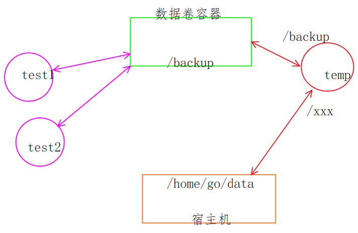

## 0. 导出镜像的两种方式

- 第一种  -> 基于镜像, 导出镜像, 不能修改镜像

  ```shell
  # 导出
  $ docker save --output/-o 导出之后的镜像的名字 要导出镜像名
  # 导入
  $ docker load --input/-i 要导入的镜像名 
  $ docker load < 要导入的镜像名 
  ```

- 第二种 -> 基于容器, 导出镜像, 可以修改镜像

  ```shell
  # 创建和启动容器
  $ docker run -itd --name contains 镜像名(ubuntu) bash(shell命令)
  # 导出
  $ docker export 容器名 > 导出的镜像名(随便起名)
  # 导入
  $ cat 要导入的镜像文件名 | docker import - 导入的新镜像的名字
  ```

- 区别

  - 导出
    - 通过export导出的时候, 会将镜像中历史记录删除, 但是save不会删除
    - 因为文件大小发送变化, 所以镜像的哈希值会发生变化
  - 导入
    - 通过import导入镜像的时候, 给导入的镜像重命名, load不可用

## 1. docker数据管理

### 1.0 数据拷贝

```shell
# 容器和宿主机之间的数据拷贝
$ docker cp 宿主机目录/文件 容器名/容器Id:容器路径
$ docker cp 容器名/容器Id:容器目录/文件 宿主机目录
```

### 1.1 数据卷和使用

- 数据卷

  宿主机的存储目录, 要将目录中的数据和docker容器进行数据共享

- 数据卷在docker中的应用

  ```shell
  # 挂载的时机:
  # 1. 容器被创建的时候
  $ docker create
  # 2. 容器被创建并运行的时候
  $ docker run
  # 需要添加的参数
   -v, --volume
   $ docker run -itd --name test -v 宿主机的路径:容器的路径 ubuntu bash
    - 宿主机的路径: 必须使用绝对路径, /home/go/abc, 如果宿主机路径不存在, 会自动创建
    - 容器的路径: 如果不存在会被自动创建
  ```

  - 权限问题

    > 通过-v进行数据卷挂载, 默认是读写的挂载方式
    >
    > - 权限是限制容器的, rw
    > - 可以修改权限, 改为只读: ro
    >
    > `docker run -itd --name test -v 宿主机的路径:容器的路径:ro ubuntu bash`

  - 挂载目录

    ```shell
    docker run -itd --name tmp2 -v /home/go/backup:/itcastxxx:ro ubuntu bash
    ```

  - 挂载文件 -> 不推荐

    ```shell
    docker run -itd --name tmp2 -v /home/go/backup/a.txt:/test2/b.sh ubuntu bash
    ```

### 1.2 数据卷容器和使用

- 数据卷容器

  > 就是一个普通的容器, 在这个容器中提供了一个挂载目录(共享目录)
  >
  > - 数据卷容器只要被创建出来就可以使用:
  >
  >   `docker create`
  >
  >   `docker run`

- 创建数据卷容器

  ```shell
  docker create -itd --name 容器名 -v 容器的挂载目录 镜像名  shell命令
  docker run    -itd --name 容器名 -v 容器的挂载目录 镜像名  shell命令
   - 容器的挂载目录: 如果不存在, 就会自动创建
  ```

- 数据卷容器的挂载使用

  ```shell
  # 挂载数据卷容器的参数
  --volumes-from 数据卷容器的名字/数据卷容器的ID
  # 1. 创建数据卷容器
  docker run -itd --name containsVolume -v /itcast_bk ubuntu  bash
  # 2. 启动测试容器1, 挂载到数据卷容器
  docker run -itd --name test1 --volumes-from containsVolume ubunut bash
  # 3. 启动测试容器2, 挂载到数据卷容器
  docker run -itd --name test2 --volumes-from containsVolume ubunut bash
  # 4. 测试数据是否共享
  # 4.1 进入到test1/test2容器中
  docker exec -it test1 bash
  docker exec -it test2 bash
  ```

### 1.3 数据卷容器数据备份



```shell
# 挂载数据卷容器的参数
--volumes-from 数据卷容器的名字/数据卷容器的ID
# 1. 创建数据卷容器
docker run -itd --name containsVolume -v /itcast_bk ubuntu  bash
# 2. 启动测试容器1, 挂载到数据卷容器
docker run -itd --name test1 --volumes-from containsVolume ubunut bash
# 3. 启动测试容器2, 挂载到数据卷容器
docker run -itd --name test2 --volumes-from containsVolume ubunut bash
# 4. 测试数据是否共享
# 4.1 进入到test1/test2容器中
docker exec -it test1 bash
docker exec -it test2 bash
# 备份数据 -> 数据卷容器中的数据
# 1. 创建一个临时新容器, 挂载到数据卷容器上, 和宿主机目录形成映射关系
docker run -itd --name backup --volumes-from containsVolume -v /home/go/backup:/xxx ubunut bash
# 2. 进入到backup容器中
docker exec -it backup bash
# 3. 将itcast_bk中的内容拷贝到 xxx目录中即可
# 4. 删除backup容器即可
# 合并上述4个步骤
docker run -itd --rm --name backup --volumes-from containsVolume -v /home/go/backup:/xxx ubunut tar zcpf /xxx/backup.tar.gz /itcast_bk
```

### 1.4 备份数据还原到数据卷容器

```shell
# 还原数据 -> 数据卷容器中的数据
# 1. 创建一个临时新容器, 挂载到数据卷容器上, 和宿主机目录形成映射关系
docker run -itd --name backup --volumes-from containsVolume -v /home/go/backup:/xxx ubunut bash
# 2. 进入到backup容器中
docker exec -it backup bash
# 3. 将/xxx中的内容拷贝到 itcast_bk目录中即可
# 4. 删除backup容器即可
# 合并上述4个步骤
docker run -itd --rm --name backup --volumes-from containsVolume -v /home/go/backup:/xxx ubunut tar zxpf /xxx/backup.tar.gz -C /
```

## 2. docker网络管理

### 2.1 docker端口映射

- 随机端口映射

  ```shell
  # 创建启动容器的时候指定端口映射
  # 在宿主机随便找一个没有占用的空闲端口 he 容器的 80端口进行映射
  docker run -itd -P --name mynginx nginx 
  ```

- 指定端口映射/指定多端口映射 -> 推荐

  ```shell
  # 使用的参数
  # 指定的宿主机端口必须是空闲端口
  docker run -itd -p xxx --name mynginx nginx 
  -p: 宿主机的IP:宿主机的端口:容器的端口
      宿主机的端口:容器的端口
  # 指定多个端口映射
  docker run -itd -p 80:80 -p 81:81 --name mynginx nginx 
  ```

### 2.2 网络管理

- 网络管理相关命令

  ```shell
  # 如果多个docker容器想进行通信, 那么这些容器必须要在同一个网络中
  $ docker network --help
  Usage:  docker network COMMAND
  
  Manage networks
  
  Commands:
    connect     将指定的容器加入到指定的网络中
    create      创建一个网络
    disconnect  将容器从一个网络中删除
    inspect     查看网络的详细信息
    ls          查看当前网络
    prune       删除所有的没有被使用的网络 -> 慎用
    rm          删除一个或多个指定的网络
    
  $ docker network ls
  NETWORK ID          NAME                DRIVER              SCOPE
  2d7f80ec7ad0        bridge              bridge              local
  1e5d47e7c511        host                host                local
  713535eaeb1a        none                null                local
  # bridge网络是默认使用的网络
  ```

- docker的常用的网络模式

### 2.3 bridge 网络模式

- 创建bridge网络

  ```shell
  docker network create -d 网络驱动的名字 要创建的网络的名字
   网络驱动的名字: 默认是bridge
  ```

- 自定义网段与网关

  ```shell
   --subnet: 指定子网络的网段
   --gateway: 指定网关
  docker network create -d 网络驱动的名字 --subnet 180.18.10.0/24 --getway 180.18.10.1 要创建的网络的名字 
  $ docker network create -d bridge --subnet 180.18.10.0/24 --gateway 180.18.10.1 bridge_test 
  ```

- 在自定义网络中启动容器

  ```shell
  $ docker run -it --name test1 ubuntu bash
  --network: 指定要加入的网络
  $ docker run -it --name test1  --network bridge_test ubuntu bash
  ```

- 容器断开网络

  ```shell
  docker network disconnect [OPTIONS] NETWORK CONTAINER
  - OPTIONS:
  	-f: 强制执行
  ```

- 容器连接网络

  ```shell
  docker network connect [OPTIONS] NETWORK CONTAINER
  ```

### 2.4 host网络

```shell
$ docker run -itd --name test3 --network host ubuntu bash
```

## 3. Dockerfile

### 3.1 Dockerfile介绍

```shell
# 编写dockfile文件
# 构建一个基于ubuntu的docker定制镜像
# 基础镜像
FROM ubuntu:v1.0

# 镜像作者
MAINTAINER panda kstwoak47@163.com

# 执行命令
RUN mkdir hello
RUN mkdir world
RUN sed -i 's/archive.ubuntu.com/mirrors.ustc.edu.cn/g' /etc/apt/sources.list
RUN sed -i 's/security.ubuntu.com/mirrors.ustc.edu.cn/g' /etc/apt/sources.list
RUN apt-get update  
RUN apt-get install nginx -y

# 对外端口
EXPOSE 80
```

- 宿主机创建一个空目录, 将上边的dockerfile文件放到里边

- 在dockerfile对应的目录中执行一个命令, 构建新的镜像

  ```shell
  docker build -t mynginx:v2.0 dockerfile所在的目录(.)
  -t, --tag: 指定构建出的镜像的名字
  ```

### 3.2 Dockerfile基础指令

- FROM

  ```dockerfile
  FROM 镜像名
  FROM 镜像名:tag
  # FROM必须要出现Dockerfile的第一行(除注释), 可以连续写多个FROM创建多个镜像.
  # 如果指定的镜像名本地仓库没有, 会从远程仓库pull到本地, 远程仓库也没有 -> 报错.
  
  ```

- MAINTAINER

  ```Dockerfile
  dockerfile维护者信息
  MAINTAINER 维护人员信息
  ```

- RUN

  ```dockerfile
  # 构建镜像时候执行的shell命令, 如果命令有确认操作, 必须要加 -y
  # 如果命令太长需要换行, 行末尾需要加 \
  RUN shell命令
  	RUN mkdir /home/go/test -p
  RUN ["mkdir", "/home/go/test", "-p"]
  ```

- EXPOSE

  ```dockerfile
  # 设置对外开放的端口
  # 容器和外部环境是隔离的, 如何向从外部环境访问到容器内部, 需要容器开发端口
  # 在使用的时候, 让宿主机端口和容器开放端口形成一个映射关系, 就可以访问了
  #     docker run -itd -p 8888:80
  EXPOSE 80
  ```

### 3.3 Dockerfile运行时指令

- CMD

  ```dockerfile
  # 新镜像已经被制作完毕, 启动新镜像-> 得到一个容器
  # 容器启动后默认执行的命令
  # 一个dockerfile文件只能指定一个CMD指令
  # 如果指定多个, 只有最后一个有效
  # 该CMD会被 docker run指定的shell命令覆盖
  CMD shell命令
  CMD ["shell命令", "命令参数1", "命令参数2"]
  ```

- ENTRYPOINT

  ```dockerfile
  # docker容器启动之后执行的命令, 该命令不会被docker run指定的shell指令覆盖
  # ENTRYPOINT只能指定一个, 指定多个, 只有最后一有效
  # ENTRYPOINT 和 CMD可以同时指定
  # 如果想被docker run覆盖, 启动docker容器时可使用docker run --entrypoint
  ENTRYPOINT shell命令
  ENTRYPOINT ["shell命令", "命令参数1", "命令参数2"]
  ```

- CMD ENTRYPOINT 综合使用

  ```dockerfile
  docker run -itd ubuntu 
  # 任何docker run设置的命令参数或者CMD指令的命令，都将作为ENTRYPOINT 指令的命令参数，追加到ENTRYPOINT指令之后
  ENTRYPOINT mkdir /home/go/a/b/c/d/e/f
  CMD -p
  mkdir /home/go/a/b/c/d/e/f -p 
  ```

### 3.4 Dockerfile文件编辑指令

- ADD

  ```dockerfile
  # 将宿主机文件拷贝到容器目录中
  # 如果宿主机文件是可识别的压缩包, 会进行解压缩 -> tar
  ADD 宿主机文件 容器目录/文件
  # 实例
  ADD ["宿主机文件", "容器目录"]
   - 宿主机文件一般放到Dockerfile对应的目录中
   - 容器目录, 有可能存在, 有可能不存在
    	- 存在: 直接拷贝到容器目录
      - 不存在: 先在容器中创建一个, 再拷贝
  ADD ["a.txt", "/home/go/a.txt"]
   - 第二个参数如果指定的是一个文件名
     - 这个文件存在: 直接覆盖
     - 不存在: 直接拷贝
  ```

- COPY

  ```dockerfile
  # COPY 指令和ADD 指令功能和使用方式类似。只是COPY 指令不会做自动解压工作。
  # 单纯复制文件场景，Docker 推荐使用COPY
  COPY ["a.tar.gz", "/home/"]
  ```

- VOLUME

  ```dockerfile
  # 数据卷容器创建, 挂载点为/backup
  docker create -it --name contains -v /backup ubuntu bash
  # 其他容器挂载到数据卷容器上
  docker run -itd --volumes-from contains ubuntu bash
  
  # VOLUME 指令可以在镜像中创建挂载点，这样只要通过该镜像创建的容器都有了挂载点
  # 通过VOLUME 指定挂载点目录是自动生成的。
  VOLUME ["/data"]
  
  ```

### 3.5 Dockerfile环境指令

- ENV

  ```dockerfile
  # 设置环境变量，可以在RUN 之前使用，然后RUN 命令时调用，容器启动时这些环境变量都会被指定
  ENV <key> <value>                    （一次设置一个环境变量）
  ENV <key>=<value> ...                （一次设置一个或多个环境变量）
  ENV HELLO 12345
  ENV HELLO=12345
  ENV HELLO=12345 WORLD=12345 NIHAO=12345
  ```

- WORKDIR

  ```dockerfile
  # 切换目录，为后续的RUN、CMD、ENTRYPOINT 指令配置工作目录。相当于cd
  # 可以多次切换(相当于cd 命令)，
  # 也可以使用多个WORKDIR 指令，后续命令如果参数是相对路径，则会基于之前命令指定的路径。
  WORKDIR /path/to/workdir
  RUN a.sh
  WORKDIR /path
  WORKDIR to	# 相对路径
  WORKDIR workdir
  RUN pwd
  /path/to/workdir
  ```

- USER 

  ```dockerfile
  # 指定运行容器时的用户名和UID，后续的RUN 指令也会使用这里指定的用户。
  # 如果不输入任何信息，表示默认使用root 用户
  USER daemon
  ```

- ARG

  ```dockerfile
  # ARG 指定了一个变量在docker build 的时候使用，可以使用--build-arg <varname>=<value>来指定参数的值。
  ARG <name>[=<default value>]
  ```

### 3.6 Dockerfile触发器指令

- ONBUILD

  ```dockerfile
  # 当一个镜像A被作为其他镜像B的基础镜像时，这个触发器才会被执行，
  # 新镜像B在构建的时候，会插入触发器中的指令。
  ONBUILD [command]
  
  # 原始镜像 -> 纯净版
  	-> 修改 ONBUILD ["echo", "hello,linux"]
  	   
  # 基于原始镜像制作新镜像 -> 镜像A
  	-> 启动镜像A -> 不会输出hello, linux
  	
  # 基于镜像A制作了镜像B
  	-> 启动镜像B -> 会输出 hello, linux
  ```